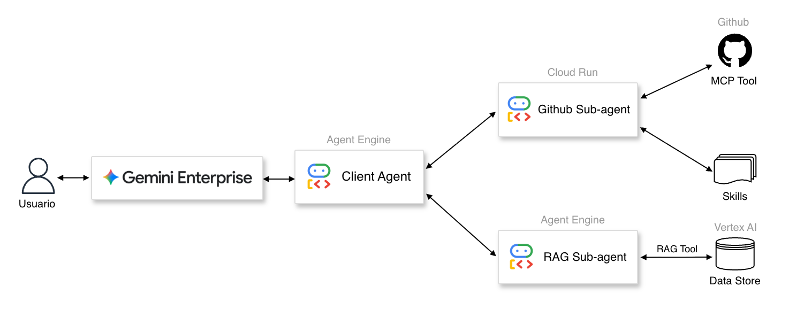

# Google Hackathon Agents

[](https://www.python.org/)
[](https://google.github.io/adk-docs/)
[](https://cloud.google.com/)

This repo contains the hackathon delivery for a Gemini Enterprise GitHub assistant. Users interact with a Client Agent running on Vertex AI Agent Engine, which routes work to two sub-agents: a GitHub specialist backed by an MCP tool and skills, and a RAG specialist backed by Vertex AI vector search. Together they provide a single GitHub copilot experience while keeping user-facing orchestration, GitHub operations, and retrieval independently deployable.

This repo is intentionally split into two self-contained projects:

```text
google-hackathon/
├── client_agent/   # Gemini Enterprise-facing ADK agent on Agent Engine
├── github_agent/   # GitHub specialist A2A service on Cloud Run
└── docs/           # Supporting architecture and mock RAG docs
```

## Architecture



The runtime splits orchestration, GitHub operations, and retrieval into separate
deployable services.

```text
Gemini Enterprise
  -> client_agent
  -> RemoteA2aAgent
  -> github_agent
  -> GitHub MCP
  -> GitHub
```

## Directory Guide

- `client_agent/`: The user-facing agent. It runs on Agent Engine and delegates GitHub work to the remote A2A service.
- `github_agent/`: The MCP-backed GitHub specialist. It serves an A2A agent card and handles GitHub retrieval tasks.
- `docs/knowledge_base/`: Secondary reference material and mock retrieval docs for the project.

Each directory has its own:

- `Makefile`
- `pyproject.toml`
- environment file template
- deployment workflow

That means each agent can be worked on, deployed, and reviewed independently.
